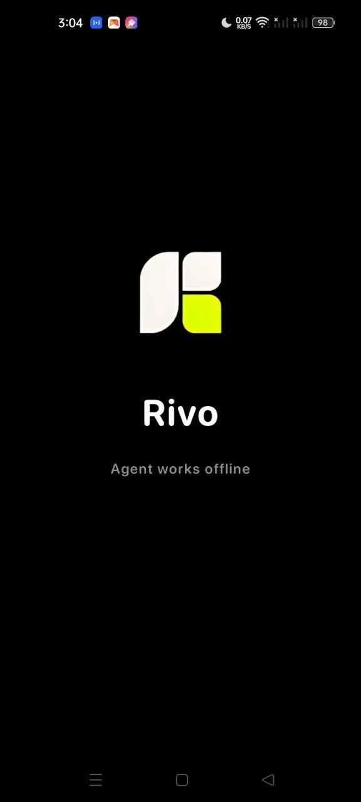
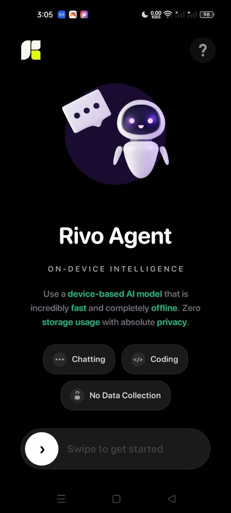
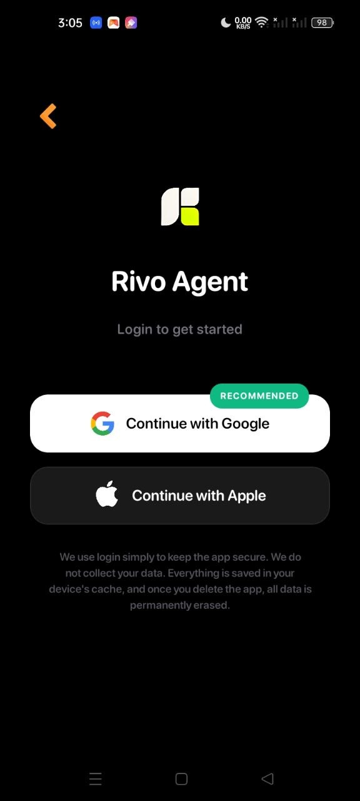
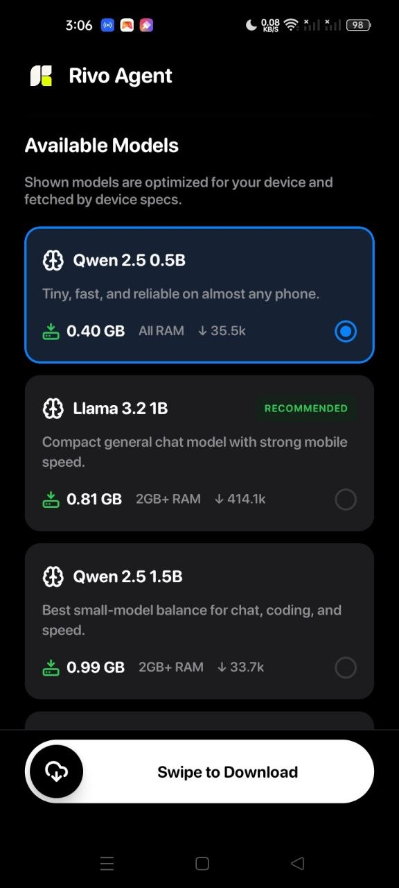
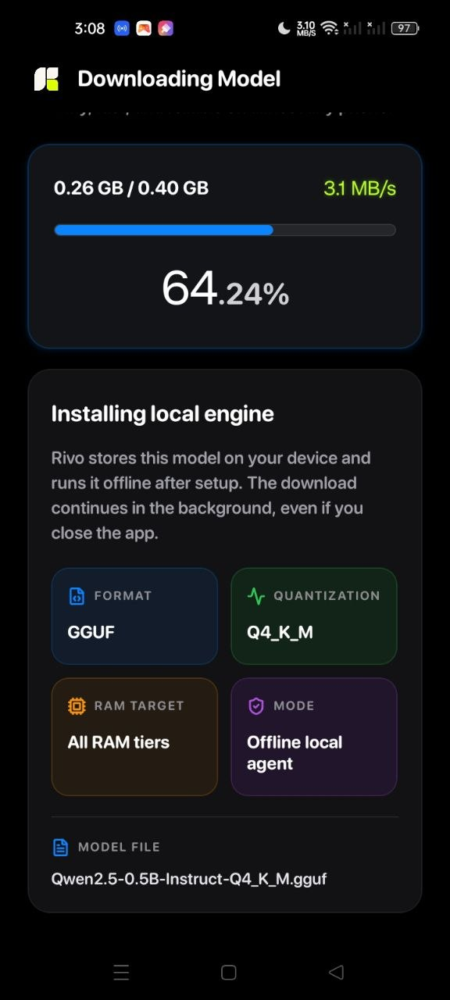
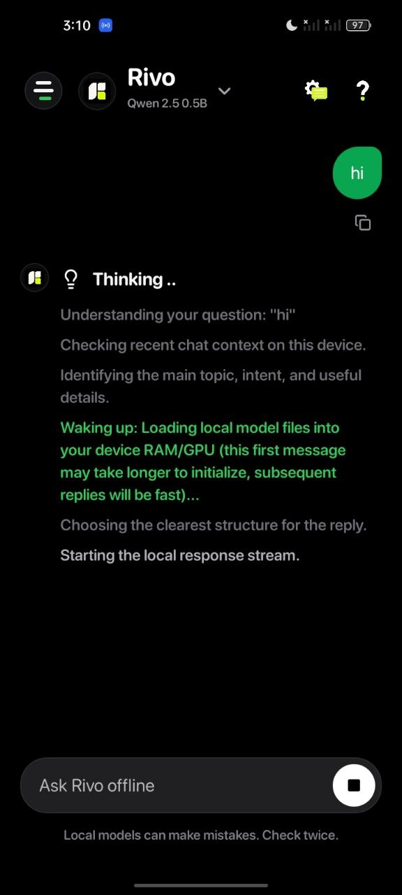
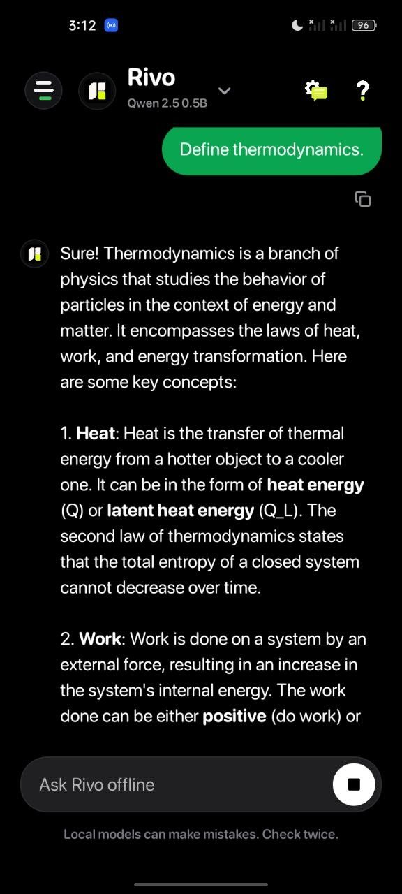
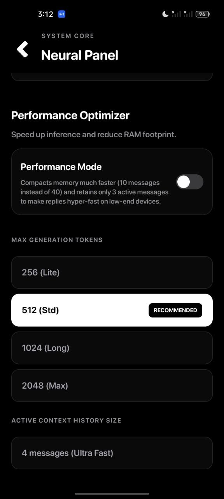

<p align="center">
  <a href="https://www.sparse.in">
    
  </a>
</p>

<h1 align="center">Rivo Agent</h1>

<p align="center">
  A private, local-first AI assistant that runs compact language models directly on your Android device.
</p>

<p align="center">
  <a href="https://github.com/sanketpadhyal/Rivo-Agent/releases/download/v1.0.0/rivo-agent.apk"><strong>Download Android APK</strong></a>
  &nbsp;&middot;&nbsp;
  <a href="../../releases">All Releases</a>
  &nbsp;&middot;&nbsp;
  <a href="../../issues">Report a Problem</a>
</p>

<p align="center">
  <a href="../../releases/latest">
    
  </a>
  <a href="../../releases/latest">
    
  </a>
  
  
</p>

> [!IMPORTANT]
> Rivo Agent is currently focused on Android. Internet access is required for sign-in, model catalog metadata, and first-time model download. After setup, normal chat inference runs locally on the device.

## About Rivo Agent

Rivo Agent turns a phone into a small offline AI workstation. The app helps users choose a compatible GGUF model, download it to local storage, verify the model file, and run chat inference through `llama.rn`.

The main chat experience is designed for private conversations, coding help, brainstorming, writing support, short local memory, and fast on-device reasoning without sending chat content to a remote model server.

Rivo uses Firebase Auth and Google Sign-In for app access. The assistant conversation itself is handled locally after a model is installed.

## App Preview

<p align="center">
  
  
  
</p>

<p align="center">
  
  
  
</p>

<p align="center">
  
  
</p>

## Download Rivo Agent

The latest documented Android build is available here:

[Download Rivo Agent v1.0.0 APK](https://github.com/sanketpadhyal/Rivo-Agent/releases/download/v1.0.0/rivo-agent.apk)

1. Download the APK on an Android device.
2. Open the downloaded `.apk` file.
3. If Android asks for permission, allow installation from the selected source.
4. Sign in and complete the model setup flow.
5. Start chatting after the model-ready screen appears.

Use the [Releases page](../../releases) for official builds and release notes.

## What You Can Do

### Local AI Chat

- Chat with an installed GGUF model directly on your phone.
- Ask questions, write code, brainstorm ideas, and draft text.
- Stream responses with a stop control.
- Copy full messages or individual code blocks.
- Share assistant responses through the native Android share sheet.
- Continue working after setup without cloud model calls for normal replies.

### Model Setup

- Detect device name, RAM, and available storage.
- View compatible models from a curated catalog.
- See recommended models based on phone capability.
- Download models in the background with progress and speed tracking.
- Continue supported downloads when an active task already exists.
- Verify downloaded files by size, readability, and GGUF header.
- Delete local models when storage needs to be freed.

### Local Memory And Threads

- Keep recent chats saved locally on the device.
- Create up to seven local threads.
- Load or delete previous local threads.
- Store short user memory and assistant preferences.
- Compact long conversations into smaller memory notes.
- Use Performance Mode to keep memory usage lighter on lower-end devices.

### Neural Panel

- Rename the assistant.
- Adjust assistant personality.
- Set emoji behavior.
- Add the user's name and memory notes.
- Choose maximum generation tokens.
- Tune active context size.
- Enable or disable Performance Mode.
- View local context and cache status.

### Privacy And Control

- Run model inference on-device after setup.
- Store chat threads, settings, memory, and model metadata locally with `AsyncStorage`.
- Keep downloaded models in the app's Android file directory.
- Clear local state and downloaded model files during logout.
- Use professional confirmation alerts before destructive actions.

## First-Time Flow

1. Open Rivo Agent.
2. Continue from the splash and home screens.
3. Sign in with Google.
4. Let onboarding read device RAM and storage.
5. Choose a recommended or supported model.
6. Wait for the model download and verification to finish.
7. Review the model-ready screen.
8. Enter the chat workspace and start using local AI.

## Main App Areas

| Area | What it is for |
| --- | --- |
| Splash | Branded startup experience |
| Home | Product introduction and entry point |
| Login | Firebase and Google Sign-In access |
| Onboarding | Device checks, model list, recommendations, and model selection |
| Download | Background model download, speed, progress, and verification |
| Model Ready | Setup confirmation before chat |
| Chat | Local AI assistant, threads, memory, settings, copy, share, and logout |
| Neural Panel | Assistant behavior, memory, tokens, context, and performance settings |

## Supported Models

Rivo currently supports a curated set of GGUF models hosted on Hugging Face.

| Model | File | Minimum RAM | Approx. Size |
| --- | --- | ---: | ---: |
| Qwen 2.5 0.5B | `Qwen2.5-0.5B-Instruct-Q4_K_M.gguf` | Any | 0.40 GB |
| Llama 3.2 1B | `Llama-3.2-1B-Instruct-Q4_K_M.gguf` | 2 GB | 0.81 GB |
| Qwen 2.5 1.5B | `Qwen2.5-1.5B-Instruct-Q4_K_M.gguf` | 2 GB | 0.99 GB |
| Gemma 2B | `gemma-2-2b-it-IQ3_M.gguf` | 3 GB | 1.39 GB |
| Qwen 2.5 3B | `Qwen2.5-3B-Instruct-Q4_K_M.gguf` | 4 GB | 1.93 GB |
| Llama 3.2 3B | `Llama-3.2-3B-Instruct-Q4_K_M.gguf` | 4 GB | 2.02 GB |
| Phi 3.5 Mini | `Phi-3.5-mini-instruct-Q4_K_M.gguf` | 6 GB | 2.39 GB |
| Mistral 7B | `mistral-7b-instruct-v0.2.Q3_K_L.gguf` | 6 GB | 3.82 GB |
| Llama 3 8B | `Meta-Llama-3-8B-Instruct.Q3_K_L.gguf` | 8 GB | 4.32 GB |

Model files remain subject to the licenses and hosting terms of their original creators. Rivo does not own third-party model weights.

## How Rivo Works

Rivo is a React Native app with native Android support for local model files.

- React Native handles screens, local state, animations, chat UI, and setup flow.
- `llama.rn` loads the selected GGUF file and runs local completions.
- Firebase Auth and Google Sign-In handle app access.
- `AsyncStorage` stores local app state, chat threads, memory, settings, and model metadata.
- `@kesha-antonov/react-native-background-downloader` handles large model downloads.
- `react-native-device-info` reads RAM, storage, and device details for model recommendations.
- A custom Kotlin module verifies, migrates, copies, and deletes model files.
- A custom Kotlin clipboard module supports message and code copying.

## Technical Stack

| Area | Technology |
| --- | --- |
| Mobile app | React Native `0.85.3` |
| UI framework | React `19.2.3` |
| Language | TypeScript |
| Local inference | `llama.rn` |
| Authentication | Firebase Auth, Google Sign-In |
| Downloads | `@kesha-antonov/react-native-background-downloader` |
| Local persistence | `@react-native-async-storage/async-storage` |
| Device detection | `react-native-device-info` |
| Layout safety | `react-native-safe-area-context`, `react-native-screens` |
| Icons | `lucide-react-native` |
| Website | React and Create React App |

## Project Structure

```text
.
|-- App.tsx                         Main app state machine and screen routing
|-- index.js                        React Native entry point
|-- src/
|   |-- assets/                     Fonts, icons, and app images
|   |-- components/                 Shared UI components
|   |-- data/modelCatalog.ts        Curated GGUF model catalog
|   |-- screens/                    Splash, auth, onboarding, download, ready, chat
|   |-- theme/colors.ts             Shared color tokens
|   `-- utils/modelInstallStatus.ts Model verification and install-state helpers
|-- android/                        Android native project and Kotlin modules
|-- ios/                            iOS native project scaffold
|-- demo-images/                    README screenshots
|-- __tests__/                      Jest tests
`-- rivo website/frontend/          Companion website
```

## Native Android Modules

Rivo includes custom Kotlin modules under `android/app/src/main/java/com/rivoapp/`.

| Module | Purpose |
| --- | --- |
| `ModelFileModule.kt` | Exposes model directory constants, file info, GGUF header validation, file copy, and file deletion |
| `ClipboardModule.kt` | Provides native clipboard support for messages and code blocks |
| `ModelFilePackage.kt` | Registers Rivo native modules with React Native |

The Android build also includes GGML Hexagon assets under `android/app/src/main/assets/ggml-hexagon/`.

## Current Status

| Part | Status |
| --- | --- |
| Android app | Active development |
| APK release | Available through GitHub Releases |
| On-device model chat | Available after model setup |
| Model recommendation | Available |
| Background model download | Available |
| Local threads and memory | Available |
| Neural Panel | Available |
| iOS project | Present as scaffold, not the current production target |
| Companion website | Included in `rivo website/frontend/` |

Features may be added, removed, renamed, or rebuilt as the product evolves.

## Configuration Notes

Before running the app on a fresh machine, configure these project-specific values:

- Copy `android/app/google-services.example.json` to `android/app/google-services.json`.
- Replace the placeholder Firebase values with the real Firebase Android app configuration.
- Replace `YOUR_WEB_OAUTH_CLIENT_ID` in `src/screens/LoginScreen.tsx` with the Google web OAuth client id used by Firebase Auth.
- Make sure the Android package name in Firebase is `com.rivoapp`.
- Use your own release keystore before shipping a production APK. The current release build type still points to the debug keystore.

Do not commit private Firebase credentials, release keystores, signing passwords, or production secrets.

## Release Checklist

Before publishing a new Android build:

- Update `android/app/build.gradle` version code and version name.
- Confirm Firebase and Google Sign-In are configured for the release package.
- Replace debug signing with production signing.
- Build and test the APK on a physical Android device.
- Confirm model download, verification, chat, copy, share, logout, and cleanup flows.
- Update the GitHub release tag, APK link, and README release notes.

## About This Repository

This repository contains the Rivo Agent mobile app, Android native project, iOS scaffold, tests, documentation, screenshots, and companion website source.

The repository is private and maintained by the developer. The source code, app assets, and implementation details are not licensed for copying, redistribution, or commercial reuse.

## Developer

Developer: Sanket Padhyal  
Website: `https://www.sanketpadhyal.in`  
Support: `sanketpadhyal3@gmail.com`

## Disclaimer

Rivo runs local AI models that can produce incorrect, incomplete, or unexpected responses. Users should verify critical information before relying on any answer.

Rivo does not claim ownership of third-party model weights, logos, names, or provider assets referenced by the application. All third-party model files remain subject to their original licenses and hosting terms.

All rights reserved.

## Local Development Setup

Use this section to set up the codebase on your PC and start coding.

### 1. Install prerequisites

Install:

- Node.js `22.11.0` or newer.
- npm.
- Java Development Kit compatible with the Android Gradle Plugin.
- Android Studio.
- Android SDK Platform `36`.
- Android Build Tools `36.0.0`.
- Android NDK `27.1.12297006`.
- A physical Android device or Android emulator.
- Xcode and CocoaPods only if you plan to work on the iOS scaffold.

### 2. Clone the repository

```bash
git clone <repo-url>
cd "Rivo-Agent-Application"
```

If your folder path contains spaces, keep quotes around the path when using shell commands.

### 3. Install mobile dependencies

```bash
npm install
```

### 4. Add Firebase and Google Sign-In config

```bash
cp android/app/google-services.example.json android/app/google-services.json
```

Then edit `android/app/google-services.json` with the real Firebase project values and update the Google web OAuth client id in `src/screens/LoginScreen.tsx`.

### 5. Link font assets if needed

Fonts are configured in `react-native.config.js`.

```bash
npx react-native-asset
```

Run this only if fonts are not already present in the native asset folders.

### 6. Start Metro

```bash
npm start
```

Keep Metro running in one terminal.

### 7. Run the Android app

In a second terminal:

```bash
npm run android
```

For a production-style APK build:

```bash
cd android
./gradlew assembleRelease
```

The generated APK will be under `android/app/build/outputs/apk/release/`.

### 8. Run tests and checks

```bash
npm test
npm run lint
```

### 9. Run the companion website

```bash
cd "rivo website/frontend"
npm install
npm start
```

The website runs with Create React App and opens on the local development server printed by the terminal.
